# Homework 1
> 作業位址：[Homework 1](https://hackmd.io/wApWgkUpR8WJEaLNbYz5Kw)

## 0、Windows 10 開發環境建置

### 安裝 Windows 10 作業系統的 Node.js 開發環境
- [Node.js](https://nodejs.org/en/download/)（必要）
- [Git](https://git-scm.com/downloads)（可選）
- [SourceTree](https://www.sourcetreeapp.com/)（可選）
- [Visual Studio Code](https://code.visualstudio.com/Download)（可選）

### 安裝 Node.js 流程

- 進到 Node.js 官網 [https://nodejs.org/en](https://nodejs.org/en)，並點選下載 [LTS（穩定版）](https://nodejs.org/dist/v8.12.0/node-v8.12.0-x64.msi)版（預設是下載到 %USERPROFILE%\Downloads 資料夾內。


- 檔案下載後，滑鼠連點兩下執行安裝檔。

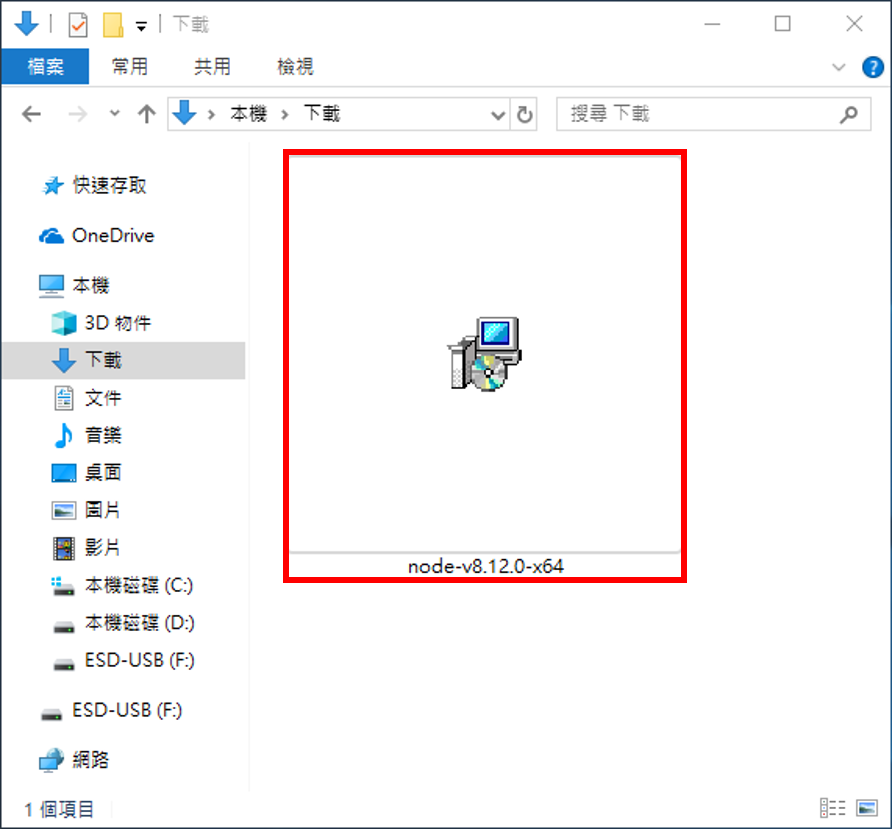

- 點選【Next】。

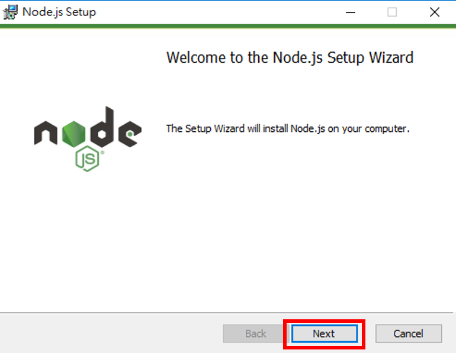

- 勾選【Iaccept the terms in the License Agreement】同意使用條款 →【Next】。


- 使用預設的安裝位置，點選【Next】。


- 預設是全功能安裝，點選【Next】。

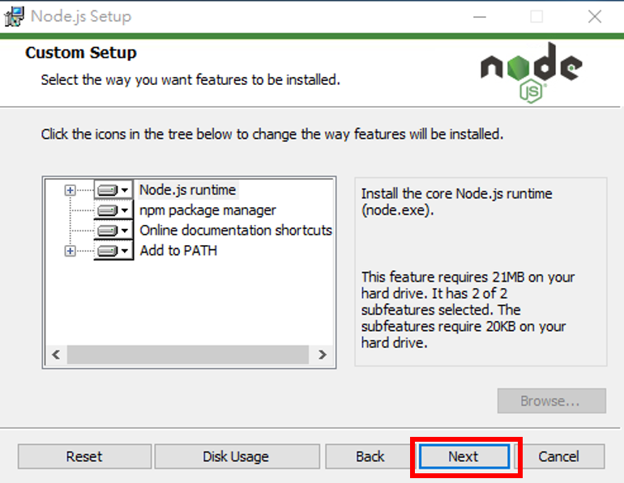

- 點選【Install】後開始安裝。

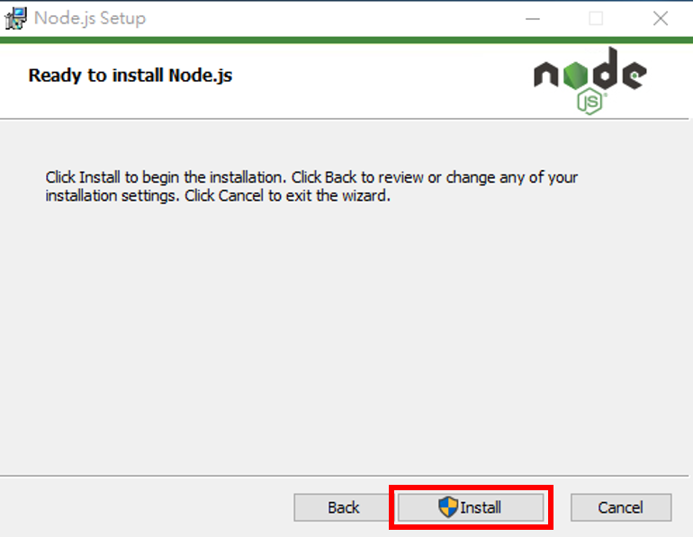

- 點選【Finish】完成 Node.js 的安裝。

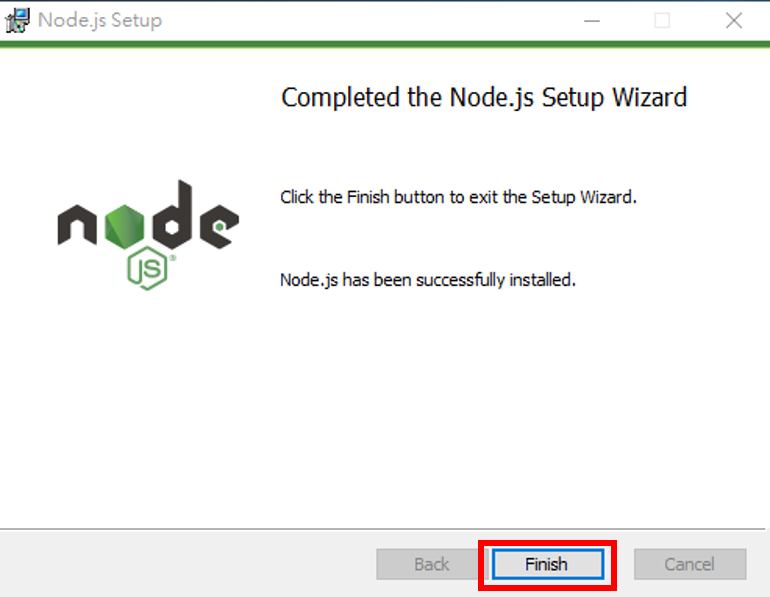


### 設置 Windows 10 作業系統用於 npm 環境變數

- 設定 Windows 環境變數。
- 請至「控制台」→「系統及安全性」→「系統」→「進階系統設定」→「進階」標籤→「環境變數(N)...」→在「XXX 的使用者變數」內新增、編輯。


- 點選「Windows 符號」→ 點選【Windows 系統】→ 點選【控制台】


- 點選【系統及安全性】。

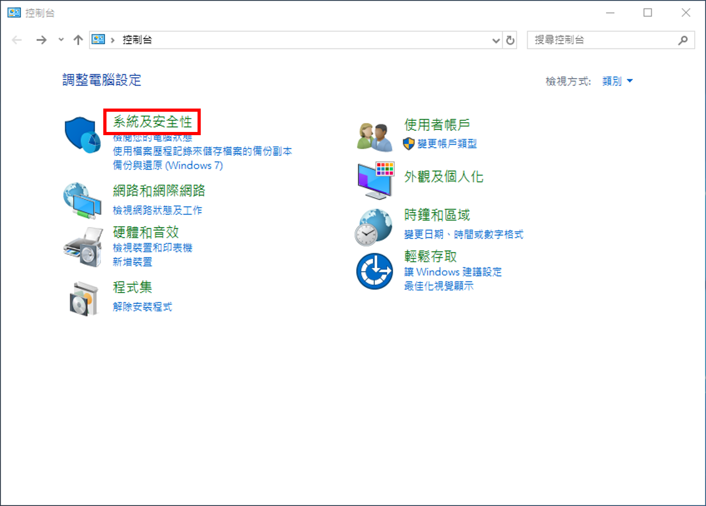

- 點選【系統】。

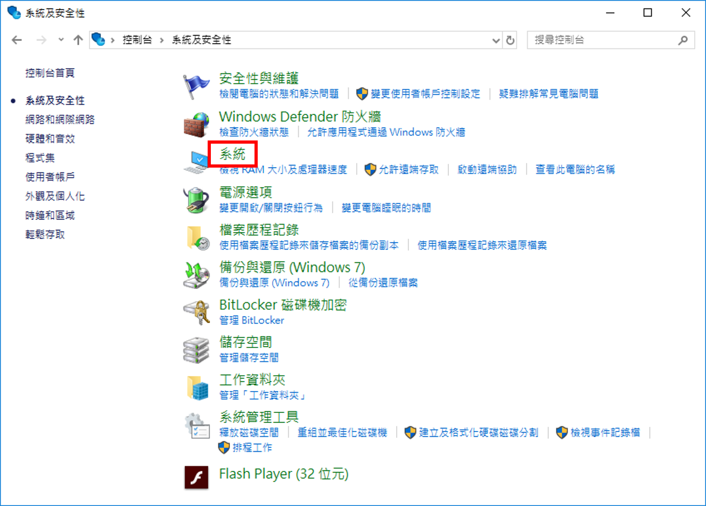

- 點選【進階系統設定】。


- 在出現的「系統內容」視窗後，點選【進階】標籤 → 點選【環境變數(N)...】。

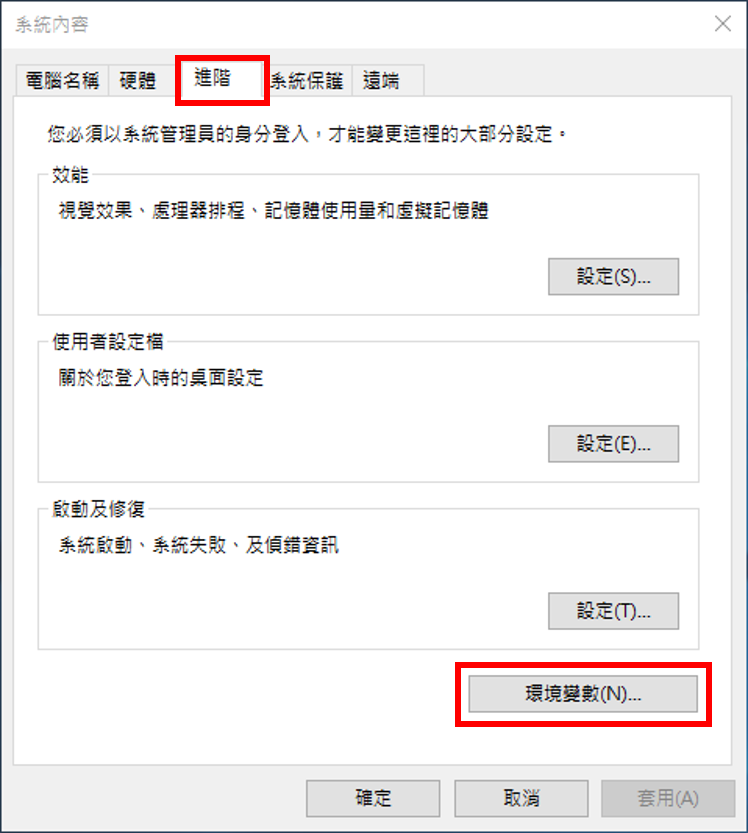

- 在上方「XXX 的使用者變數(U)」中，點選【新增(N)...】。


- 在出現的「新增使用者變數」視窗中，輸入下方數值：

	- 「變數名稱(N):」=【NODE_PATH】
	- 「變數值(V):」=【%AppData%\npm\node_modules】→ 點選【確定】


- 點選【確定】完成環境變數的設置。

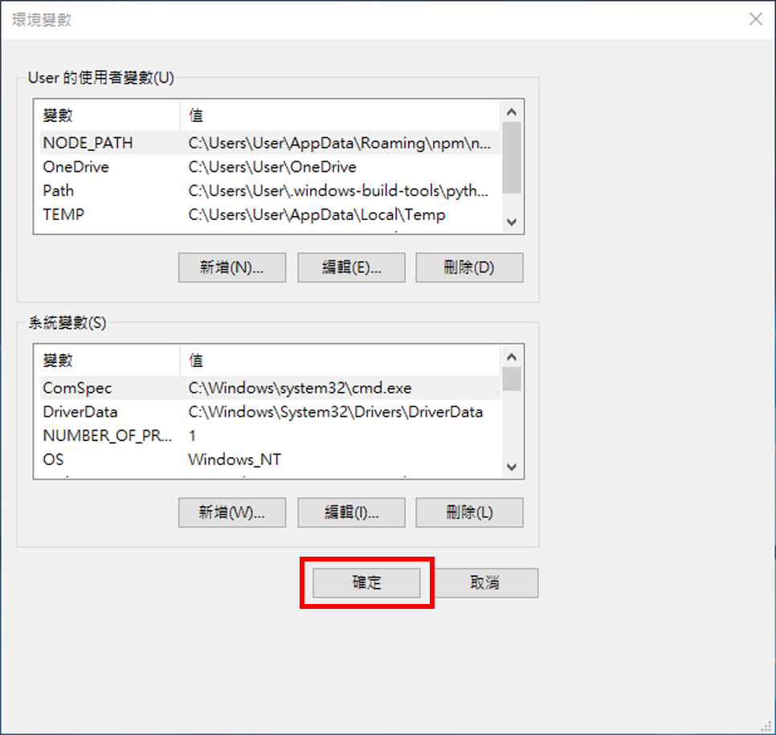

### 設置 Windows 10 作業系統的 Node.js 開發環境

- 點選「Windows 符號」→ 點選【Windows 系統】→ 在「命令提示字元（%windir%\system32\cmd.exe）」上按滑鼠【右鍵】→ 點選【更多】→【以系統管理員身分執行】。

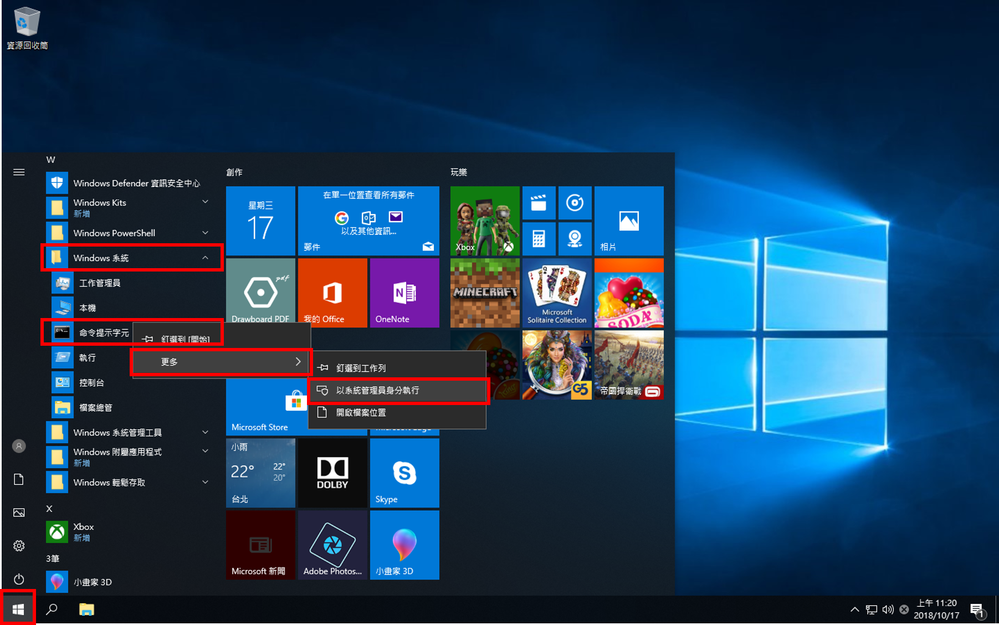

- 執行下方指令以進行 Node.js for Windows 必要工具安裝。
	- 註：安裝過程需耗時 20 分鐘左右，請耐心等待，勿關閉視窗。
	- 註：會將 windows-build-tools 下載至 `%USERPROFILE%\.windows-build-tools` 目錄內。

```bash=1
> npm install --global --production windows-build-tools
```

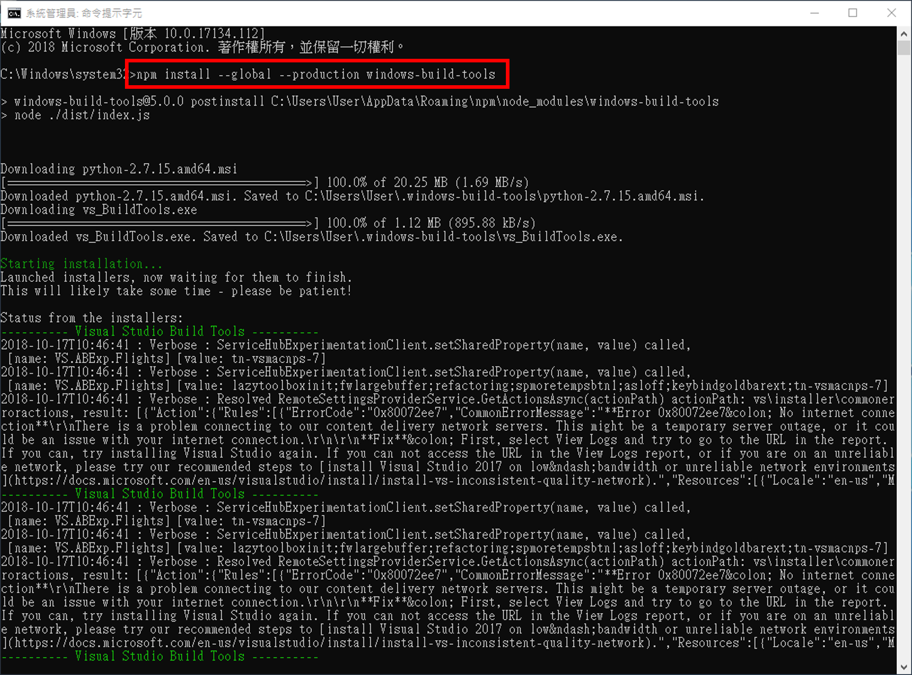

### 設置 Windows 10 作業系統的 Ethereum 以太坊 Node.js 開發環境
- 再次執行【命令提示字元（%windir%\system32\cmd.exe）】後執行下述指令。
- 註：會將 Node.js 的 Modules 下載至 `%AppData%\npm\node_modules` 內。

```bash=1
> npm install --global ethereumjs-wallet
> npm install --global js-sha3
```

### 測試 Ethereum 以太坊 Node.js 開發環境可正常運作

#### 撰寫測試程式碼

- 在 `.\Homework-1\key.js` 檔內撰寫如下程式碼：

```javascript=1
// npm-library
const Wallet = require('ethereumjs-wallet');
const keccak256 = require('js-sha3').keccak256;

// keypair
const wallet = Wallet.generate();
 
// privKey
const privKey = wallet.getPrivateKey();
console.log("privKey:", privKey);
 
// pubKey
const pubKey = wallet.getPublicKey();
console.log("pubKey:", pubKey);

// address
let address = wallet.getAddressString();
console.log("address:", address);
```

#### 執行測試程式碼

```bash=1
> cd %USERPROFILE%\go\src\github.com\oneleo\201809-Ethereum-DApp-Development-Homework
> node .\Homework-1\key.js
```

#### 程式碼執行結果

```
privKey: <Buffer 54 4c 7e 8c a9 6a 77 f9 da 4a 7a bb b3 b8 44 a7 45 e3 e3 51 50 2b 2e 0d 9a 15 a6 34 8b 41 43 33>
pubKey: <Buffer cd c5 f9 47 4d 76 91 0a 21 f2 5c 89 69 d2 72 bb 64 f2 eb e4 42 48 97 d9 3c 4a 5a d5 b7 83 db ad a1 d2 87 b0 3f d5 5b 00 b6 3b e7 b8 22 c7 f8 09 b4 31 ... >
address: 0x172051bda8a8d52afb906c333fa09a32d6ee3c9c
```

## 1、第 01 題

### 題目

- Please compare hash function and cryptographic hash function and give an example.

### 回答

- Hash Function 雜湊演算法

	- 特性：

		- 很容易計算出任一給定訊息的 Hash 值。
		- 很難去計算從已知的 Hash 值，來推算出原始的訊息。
		- 使用同一個 Hash Function 下，若兩個輸出的 Hash 值不相同，則這兩個 Hash 值的原始輸入值必不相同。
		- 使用同一個 Hash Function 下，若兩個輸出的 Hash 值相同，則這兩個 Hash 值的原始輸入值可能相同、可能不相同；當兩個 Hash 值的原始輸入值不相同，但輸出的 Hash 值相同時，稱之為 Hash 碰撞（Collision），通常是被刻意計算出相同的輸出值，以進行碰撞攻擊（Collision Attack）。

	- 舉例：

		- 雜湊表（Hash Tables）：
			- 例如，在找尋電話簿中某人號碼時，我們可在初次搜尋，透過姓名-姓氏 Hash Function，來建立 Hash Tables（如：以「王」姓來分類的電話號碼群（bucket）），這樣未來再次查找的姓名一樣姓「王」時，就可以直接從對映的「王」姓群，來加速找到此人的電話號碼。
			- 可用來查找重複資料。
			- 可在高速記憶體中建立慢速硬碟的資料緩存（Caches），以加速覆寫舊資料、或比較文件的速度。
		- 錯誤校正
			- 透過接收到的資料及此資料的 Hash 值，就可使用相同的 Hash Function 來計算這份資料是否在傳輸的過程中有錯誤或被篡改。
			- 可確保傳遞真實的資訊。
		- 保護資料（Protecting data）
			- 使用抗碰撞的 Hash Function，如密碼雜湊函數（Cryptographic Hash Function），即可用於唯一地識別機密資訊（如：Facebook 登入密碼的 Hash 值，不會因惡意碰撞攻擊而遭人破解登入；網路上下載經 Hash 值認證的軟體，不會因惡意碰撞攻擊而誤執行木馬病毒。因不同的機密資訊，必定取得不同的 Hash 值）。
		- 局部敏感雜湊（Locality-sensitive hashing）
			- 設計一個 Hash Function，使得類似的資料，可透過 Hash Function 對映到同一個群（bucket），或是鄰近的群。
			- 可用來快速查找類似的紀錄。
			- 可用來快摙尋找類似的子字串（如：Rabin-Karp 字串搜尋演算法）。
			- 可用來進行語音辨識：如 [Shazam 服務](https://www.shazam.com/zh)可從吵雜的房間內透過 Hash Function 找到對映正在播放的音樂。	
		
- Cryptographic Hash Function 密碼雜湊函式

	- 特性：

		- 很容易計算出任一給定訊息的 Hash 值。
		- 很難去計算從已知的 Hash 值，來推算出原始的訊息。
		- 為 Hash Function 的子集合，但比 Hash Function 還更加嚴格。	
		- 使用同一個 Hash Function 下，若兩個輸出的 Hash 值不相同，則這兩個 Hash 值的原始輸入值必不相同。 
		- 使用同一個 Hash Function 下，若兩個輸出的 Hash 值相同，則這兩個 Hash 值的原始輸入值必不相同。

	- 舉例：

		- 數位簽章（Digital Signature）
			- 需搭配非對稱加密演算法（Asymmetric Cryptography）。
			- 簽名者使用私鑰將資料的 Hash 值加密作為簽章，把資料及簽章交給驗證者。
			- 驗證者使用公鑰將資料的 Hash 值解密，並比對資料的 Hash 是否和解密出來的 Hash 值一致。
			- 資料的完整性是很容易驗證。
			- 數位簽章具有不可否認性，簽名者不可抵賴已簽名且傳送的資料。

		- 訊息鑑別碼（Message Authentication Code，MAC）
			- 可用來檢查在訊息傳遞過程中內容是否被更改過。
			- 可作為訊息來源的身分驗證，確認訊息的來源。


- 參考：
	- Wikipedia - [Hash function](https://en.wikipedia.org/wiki/Hash_function)
	- Wikipedia - [Cryptographic hash function](https://en.wikipedia.org/wiki/Cryptographic_hash_function)

## 2、第 02 題

### 題目

- Peter is a noob in cryptocurrency and would like to get some Ethers. First step for him is to have an Ethereum account. He decides to generate an account and manages the wallet himself so he can understand the principles behind. From the class, he knows the account is created by the following steps:

   1. Create a keypair of private/public key
   2. public_key = ECDSA(private_key) 
   3. public_key_hash = Keccak-256(public_key)
   4. address = `'0x'` + last 20 bytes of public_key_hash

- The following is the sample code to create an address and a pair of private/public key.

```javascript=
const Wallet = require('ethereumjs-wallet');
const keccak256 = require('js-sha3').keccak256;

// keypair
const wallet = Wallet.generate();
 
// privKey
const privKey = wallet.getPrivateKey();
console.log("privKey:", privKey);
 
// pubKey
const pubKey = wallet.getPublicKey();
console.log("pubKey:", pubKey);

// address
let address = wallet.getAddressString();
console.log("address:", address);
```

- The output is like this:

```
$ node key.js

privKey: <Buffer c7 49 b3 89 eb c3 28 3f 2e 52 5f fe 46 93 70 ed 37 64 85 1a 24 81 6d 56 54 cd 9d 99 f2 c1 2e f6>
pubKey: <Buffer 30 92 f7 ed ac aa 49 e0 f1 74 ea 63 53 ce be 65 aa 3f 73 32 18 51 62 cc 00 2f 23 9b 35 86 58 83 d7 bc c6 fd 49 69 b8 80 45 91 32 fe 6d c1 9d fa 6d 64 ... >
address: 0x759c946e5306e7e6498f4286055a931fe7b08882
```

- （30%）a. Can you print the private/public key with hex string representation? Please give us an example.

For example, the following is the example of the private/public keys in hex string format. 

```
privKey:
ff1140aabc074af4b6d84b74a0b9ba8bc00c18ad239d2b44208dcf6973a890cf

pubKey: 7b77b92d1a55ef612b93c6ac02d013c82ecf164eb6e59e9d0a1313c3dd511c0d7c00a0a78aca1befb5c5b7a2487e942b1916560394abee519db6585c16bad9a3

account:
0x013e06a5bd9e5d12edcec119d5816c37caa8e3c8
```

- （20%）b. In addition, if we don’t want to use the getAddressString() to get the address, how can we obtain the address by hashing the public key?

```javascript=
/***** address *****/

// step 2:  public_key_hash = Keccak-256(public_key)
Your code

// step 3:  address = ‘0x’ + last 20 bytes of public_key_hash
Your code

console.log("address:", address);

```

- （30%）c. There is a file called Keystore that is used to encrypt the private key and save in a JSON file. Can you generate a Keystore with the password "nccu"? You can find the details about Keystore below.


```jsonld=
{
  "address": "c2d7cf95645d33006175b78989035c7c9061d3f9",
  "crypto": {
    "cipher": "aes-128-ctr",
    "ciphertext": "0f6d343b2a34fe571639235fc16250823c6fe3bc30525d98c41dfdf21a97aedb",
    "cipherparams": {
      "iv": "cabce7fb34e4881870a2419b93f6c796"
    },
    "kdf": "scrypt",
    "kdfparams": {
      "dklen": 32,
      "n": 262144,
      "p": 1,
      "r": 8,
      "salt": "1af9c4a44cf45fe6fb03dcc126fa56cb0f9e81463683dd6493fb4dc76edddd51"
    },
    "mac": "5cf4012fffd1fbe41b122386122350c3825a709619224961a16e908c2a366aa6"
  },
  "id": "eddd71dd-7ad6-4cd3-bc1a-11022f7db76c",
  "version": 3
}
```

### 回答 01

- 因為 `require('ethereumjs-wallet').generate().getPrivateKey()` 及 `require('ethereumjs-wallet').generate().getPublicKey()` 函數會回傳一組 8-bit Binary Array，故需進行 2 進制轉換至 16 進制。

- `.\Homework-1\01_keyToString.js` 程式碼如下：

```javascript=1
// 使用 JavaScript 的嚴格模式。
'use strict';

// 定義 Byte 轉 Hex String 函數。
function toHexString(byteArray) {
    return Array.prototype.map.call(byteArray, function (byte) {
        return ('0' + (byte & 0xFF).toString(16)).slice(-2);
    }).join('');
}

// 定義 Hex String 轉 Byte 函數。
function toByteArray(hexString) {
    var result = [];
    while (hexString.length >= 2) {
        result.push(parseInt(hexString.substring(0, 2), 16));
        hexString = hexString.substring(2, hexString.length);
    }
    return result;
}

// 引入 npm-library。
const Wallet = require('ethereumjs-wallet');
const keccak256 = require('js-sha3').keccak256;

// 建立一組 keypair。
const wallet = Wallet.generate();

// 取得 privKey 並印出。
const privKey = wallet.getPrivateKey();
let privKeyHex = toHexString(privKey); // To Hex String。
//console.log("privKey:\n", privKey);
console.log("privKey:\n" + privKeyHex);

// 取得 pubKey 並印出。
const pubKey = wallet.getPublicKey();
let pubKeyHex = toHexString(pubKey); // To Hex String。
//console.log("pubKey:", pubKey);
console.log("pubKey:\n" + pubKeyHex);

// 取得 address 並印出。
let address = wallet.getAddressString();
console.log("address:\n" + address);
```

- 執行結果：

```
privKey:
4e34015a6d70c07c7f0a9cb35b8bc415bec60a803bfcfa60738239d53c8715ff
pubKey:
79e0938780260271bb8abac960c0c4630b9b093ddc5c9d03d55ec1d771a9a8dfbb15595ec52f9830b632e2da4decac02bc3c1f72d1cb8e255970f143d09ddb62
address:
0xa9fc81b731b89242843afb6730ac11eb5d4c6c46
```

- 使用 [MyEtherWallet](https://www.myetherwallet.com/) 進行測試：
	- privKey
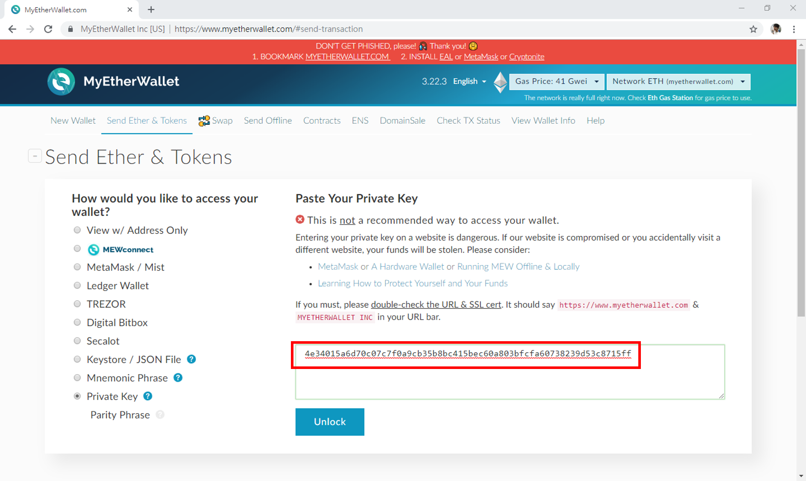
	- address
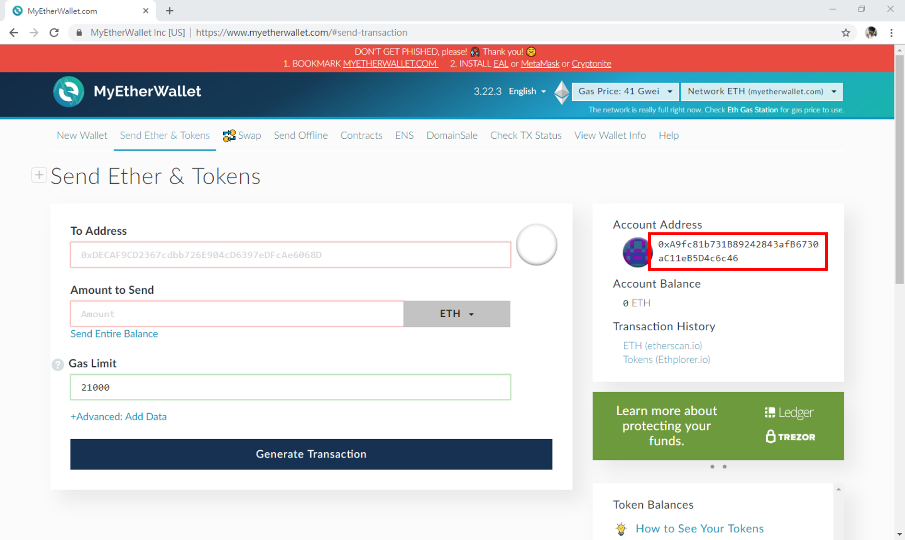

- 參考：
	- StackExchange - [Byte array to hexadecimal and back again in JavaScript](https://bitcoin.stackexchange.com/questions/52727/byte-array-to-hexadecimal-and-back-again-in-javascript)

### 回答 02

- 因為 address 是將 Public Key 經 Hash Function 取得的值，所以當我們不使用 `require('ethereumjs-wallet').generate().getAddressString()` 函數時，可以使用此方法來手動推算。

- `.\Homework-1\02_addressByHash.js` 程式碼如下：

```javascript=1
// 使用 JavaScript 的嚴格模式。
'use strict';

// 定義 Byte 轉 Hex String 函數。
function toHexString(byteArray) {
    return Array.prototype.map.call(byteArray, function (byte) {
        return ('0' + (byte & 0xFF).toString(16)).slice(-2);
    }).join('');
}

// 定義 Hex String 轉 Byte 函數。
function toByteArray(hexString) {
    var result = [];
    while (hexString.length >= 2) {
        result.push(parseInt(hexString.substring(0, 2), 16));
        hexString = hexString.substring(2, hexString.length);
    }
    return result;
}

// 引入 npm-library。
const Wallet = require('ethereumjs-wallet');
const keccak256 = require('js-sha3').keccak256;

// 建立一組 keypair。
const wallet = Wallet.generate();

// 取得 privKey 並印出。
const privKey = wallet.getPrivateKey();
let privKeyHex = toHexString(privKey); // To Hex String。
//console.log("privKey:\n", privKey);
console.log("privKey:\n" + privKeyHex);

// 取得 pubKey 並印出。
const pubKey = wallet.getPublicKey();
let pubKeyHex = toHexString(pubKey); // To Hex String。
//console.log("pubKey:", pubKey);
console.log("pubKey:\n" + pubKeyHex);

// 取得 address 並印出。
//let address = wallet.getAddressString();
//console.log("address:\n" + address);
let public_key_hash = keccak256(pubKey);
let address2 = '0x' + public_key_hash.substring(public_key_hash.length - 20 * 2); // 1 byte = 2 hex digits。
console.log("address:\n" + address2);
```

- 執行結果：

```
privKey:
ab1fd8cc136281630290b163c79ed05a196475a27ec131b7fd1d00aece404daf
pubKey:
30a652aea62cfee318ac7592d615a415ad00c38af9295bee2a1fc52d35a14978262bd5da23374a0216bfa19de9099010a3c841f665995df6c0ebfb20b26d54e8
address:
0x016c248f87f81a2d2eb35675ed4e7ad98377fa6d
```

- 使用 [MyEtherWallet](https://www.myetherwallet.com/) 進行測試：
	- privKey
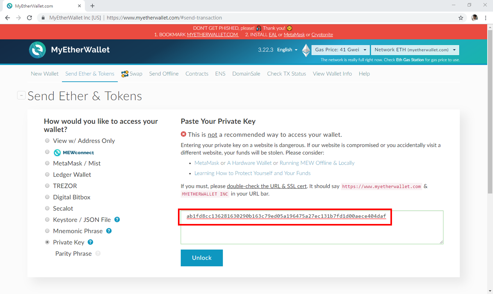
	- address


### 回答 03

- `require('ethereumjs-wallet').generate().toV3String('Password')` 函數，可透過 nccu 作為密碼將 Private Key 加密，並回傳一個 JSON String。

- `require('ethereumjs-wallet').fromV3(KeystoreFile, 'Password', true)` 函數，可透過 nccu 作為密碼將 Private Key 解密。

- `.\Homework-1\03_keystore.js` 程式碼如下：

```javascript=1
// 使用 JavaScript 的嚴格模式。
'use strict';

// 定義 Byte 轉 Hex String 函數。
function toHexString(byteArray) {
    return Array.prototype.map.call(byteArray, function (byte) {
        return ('0' + (byte & 0xFF).toString(16)).slice(-2);
    }).join('');
}

// 定義 Hex String 轉 Byte 函數。
function toByteArray(hexString) {
    var result = [];
    while (hexString.length >= 2) {
        result.push(parseInt(hexString.substring(0, 2), 16));
        hexString = hexString.substring(2, hexString.length);
    }
    return result;
}

// 引入 npm-library。
const Wallet = require('ethereumjs-wallet');
const keccak256 = require('js-sha3').keccak256;
const fs = require('fs');
const keystoreFile = './Homework_1/03_keystore';

// 建立一組 keypair。
const wallet = Wallet.generate();

// 取得 privKey 並印出。
const privKey = wallet.getPrivateKey();
let privKeyHex = toHexString(privKey); // To Hex String。
//console.log("privKey:\n", privKey);
console.log("privKey:\n" + privKeyHex);

// 取得 pubKey 並印出。
const pubKey = wallet.getPublicKey();
let pubKeyHex = toHexString(pubKey); // To Hex String。
//console.log("pubKey:", pubKey);
console.log("pubKey:\n" + pubKeyHex);

// 取得 address 並印出。
//let address = wallet.getAddressString();
//console.log("address:\n" + address);
let public_key_hash = keccak256(pubKey);
let address2 = '0x' + public_key_hash.substring(public_key_hash.length - 20 * 2); // 1 byte = 2 hex digits。
console.log("address:\n" + address2);

// 使用 nccu 作為密碼將 Private 加密。
let keystore = wallet.toV3String('nccu');
console.log("keystore:\n" + keystore);

// 將 keystore Json 寫入 03_keystore 檔內。
fs.writeFileSync(keystoreFile, keystore, 'utf8', function (err) {
    if (err) {
        console.log("An error occured while writing JSON Object to File.");
        return console.error(err);
    }
});

// 將 keystore Json 讀出後，再使用 nccu 作為密碼將 Private 解密。
//let recoverWallet = Wallet.fromV3(keystore, 'nccu', true);
let recoverWallet = Wallet.fromV3(fs.readFileSync(keystoreFile).toString(), 'nccu', true);
let recoverPrivKey = recoverWallet.getPrivateKey();
let recoverPrivKeyHex = toHexString(recoverPrivKey);
console.log("recover:\n" + recoverPrivKeyHex);
```

- 執行結果：

```
privKey:
969d2652231f3693f0827c5abb61474c5ce2e17968f89050b54fd16c752356c2
pubKey:
301406646066daac71b193536693c61af1a4e65c951ef0b60339b55ed8c1d1d394e654d62100a10cad327a90737bd1bbcb12b86659a140dae5c0a14e1a38691d
address:
0xf125ab45940dfeb6d80306ddf2495579aba13d3e
keystore:
{"version":3,"id":"eccee6bf-9e1a-4beb-a5bd-2eb9a096a269","address":"f125ab45940dfeb6d80306ddf2495579aba13d3e","crypto":{"ciphertext":"937b29e5ccd27731800aaf7fe9083ba275ee2b5154b3ac8fd981d2556ebd1e97","cipherparams":{"iv":"d63bd4cb93af51af45e658917dff7340"},"cipher":"aes-128-ctr","kdf":"scrypt","kdfparams":{"dklen":32,"salt":"e4bc73c86e350f5622e153659d03550bc20720b86086cac16cb6ba5e6410ddff","n":262144,"r":8,"p":1},"mac":"a43484f8cf0f1bdfed2a2dc694d9f1ed483d09e33b09286b2bdc7848985de9dc"}}
recover:
969d2652231f3693f0827c5abb61474c5ce2e17968f89050b54fd16c752356c2
```

- 參考：
	- StackExchange - [https://ethereum.stackexchange.com/questions/11166/how-to-generate-a-keystore-utc-file-from-the-raw-private-key](https://ethereum.stackexchange.com/questions/11166/how-to-generate-a-keystore-utc-file-from-the-raw-private-key)
	- StackExchange - [How to decrypt private key form keystore file, without using third party applications?](https://ethereum.stackexchange.com/questions/47031/how-to-decrypt-private-key-form-keystore-file-without-using-third-party-applica)
	- 菜鳥工具 - [JSON 在線解析](https://c.runoob.com/front-end/53)

## 3、第 03 題

### 題目

- What is HD Wallet, BIP32, BIP39 and BIP44?（+3%）

### 概述

- BIP（Bitcoin Improvement Proposals）：可由任何人提出之 Bitcoin 的新功能或改進措施的文件，經審核後會公佈在 [bitcoin/bips](https://github.com/bitcoin/bips) 上。 
- HD Wallet：採用 BIP 機制的錢包稱為 HD Wallet。Ethereum HD Wallet 錢包則採用 BIP32、BIP39、BIP44 規範，其第一組帳戶路徑為「m／purpose'／coin_type'／account'／change／address_index」=「m／44'／60'／0'／0／0」。
- [BIP32](https://github.com/bitcoin/bips/blob/master/bip-0032.mediawiki)：定義 HD Wallet，可從單個 Seed 產生樹狀結構，來儲存多組 Keypairs，以利備份、移轉至其他裝置、控制權限等。
- [BIP39](https://github.com/bitcoin/bips/blob/master/bip-0039.mediawiki)：將 Seed 用方便記憶 12 個單字組成，稱為助憶詞（Mnemonic Code、Phrase）。
- [BIP44](https://github.com/bitcoin/bips/blob/master/bip-0044.mediawiki)：基於 BIP32，賦予各層樹狀結構特殊的意義，使得同一組 Seed 可支援多幣種、帳戶等。

### 回答

- 此問題的完整解答，已撰寫成文章並發佈至 Steemit 平台：
	- [Steemit - 詳解 HD Wallet、BIP-0032、BIP-0039、BIP-0043 及 BIP-0044](https://steemit.com/blockchain/@oneleo/hd-wallet-bip-0032-bip-0039-bip-0043-bip-0044)
	- [SteemKR - 詳解 HD Wallet、BIP-0032、BIP-0039、BIP-0043 及 BIP-0044](https://steemkr.com/blockchain/@oneleo/hd-wallet-bip-0032-bip-0039-bip-0043-bip-0044)

## 4、第 04 題

### 題目

- What is RFC 6979 for?（+3%）

### 概述

- RFC6979：我們可以使用橢圓曲線密碼學（Elliptic curve cryptography，ECC）來生成私、公鑰對。並使用橢圓曲線數字簽名算法（Elliptic Curve Digital Signature Algorithm，ECDSA）來對文件進行簽章，RFC697 則是講述簽章的過程中 k 值要足夠隨機，否則重覆使用 k 值來進行簽章，駭客可透過多組簽章資訊來反推回私鑰。
- ECDSA 流程：
	- 私鑰為 x，公鑰為（p, q, g, y）。
	- 選取隨機數 k，0 < k < q。
	- 計算（x1, y1）= k ^ g。
	- 計算 r = x1 % q，如果 r = 0，重新選取 k 值。
	- 計算 s = （Hash（msg）+ x * r）*（k ^（-1））% q，如果 s = 0，重新選取 k 值。
	- （r, s）構成簽名。

### 回答

- 此問題的完整解答，已撰寫成文章並發佈至 Steemit 平台：
	- [Steemit - 橢圓曲線加密演算法 ECDSA 與 RFC6979 改進提案](https://steemit.com/cryptography/@oneleo/ecdsa-rfc6979)
	- [SteemKR - 橢圓曲線加密演算法 ECDSA 與 RFC6979 改進提案](https://steemkr.com/cryptography/@oneleo/ecdsa-rfc6979)
