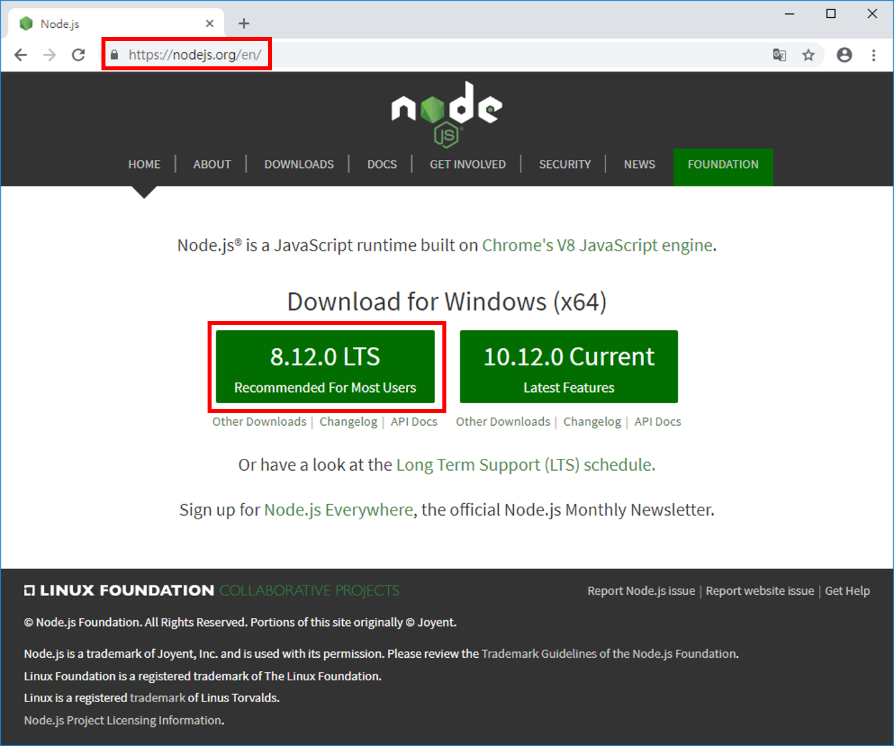
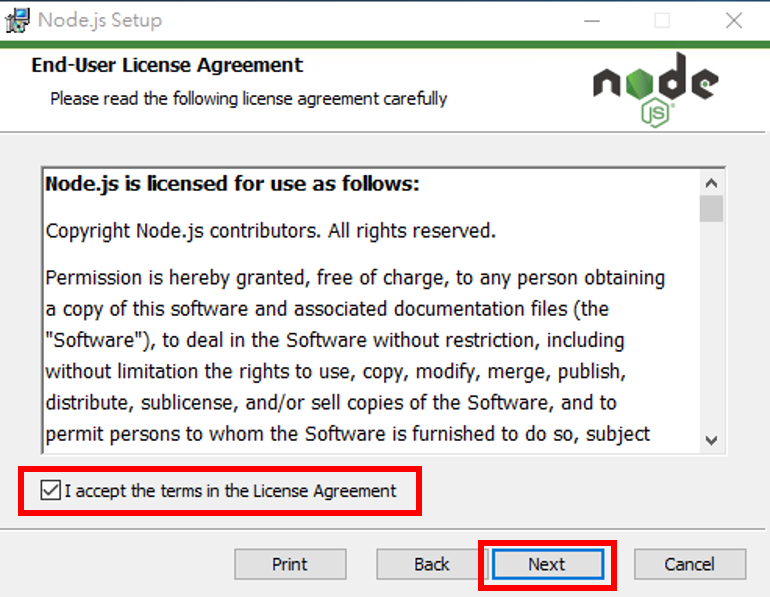
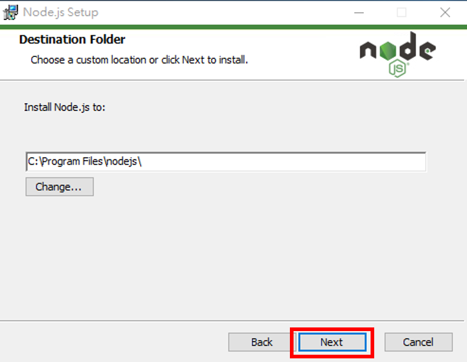
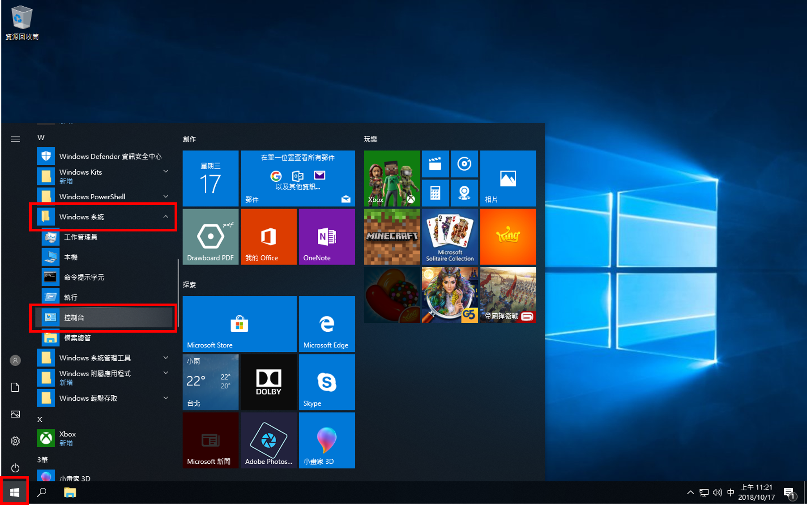
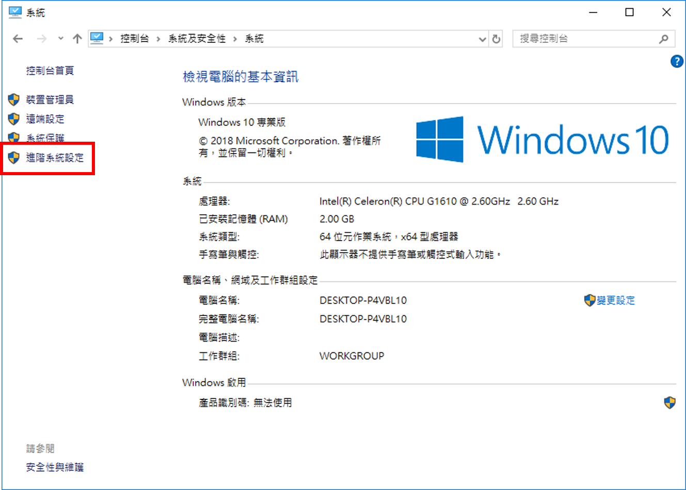
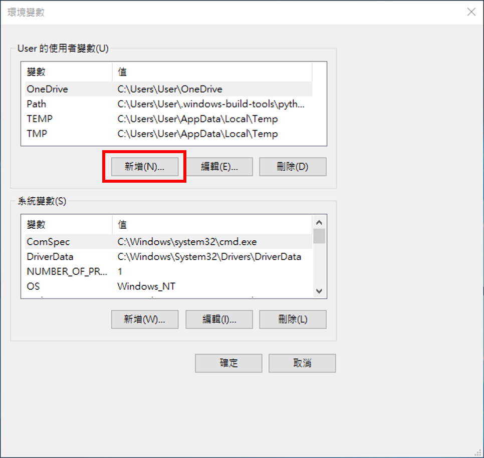

## 在 Windows 10 作業系統內建置 Node.js 的開發環境

### 安裝 Windows 10 作業系統的 Node.js 開發環境
- [Node.js](https://nodejs.org/en/download/)（必要）
- [Git](https://git-scm.com/downloads)（可選）
- [SourceTree](https://www.sourcetreeapp.com/)（可選）
- [Visual Studio Code](https://code.visualstudio.com/Download)（可選）

### 安裝 Node.js 流程

- 進到 Node.js 官網 [https://nodejs.org/en](https://nodejs.org/en)，並點選下載 [LTS（穩定版）](https://nodejs.org/dist/v8.12.0/node-v8.12.0-x64.msi)版（預設是下載到 %USERPROFILE%\Downloads 資料夾內。



- 檔案下載後，滑鼠連點兩下執行安裝檔。


- 點選【Next】。


- 勾選【Iaccept the terms in the License Agreement】同意使用條款 →【Next】。



- 使用預設的安裝位置，點選【Next】。



- 預設是全功能安裝，點選【Next】。


- 點選【Install】後開始安裝。


- 點選【Finish】完成 Node.js 的安裝。


### 設置 Windows 10 作業系統用於 npm 環境變數

- 設定 Windows 環境變數。
- 請至「控制台」→「系統及安全性」→「系統」→「進階系統設定」→「進階」標籤→「環境變數(N)...」→在「XXX 的使用者變數」內新增、編輯。


- 點選「Windows 符號」→ 點選【Windows 系統】→ 點選【控制台】



- 點選【系統及安全性】。


- 點選【系統】。


- 點選【進階系統設定】。



- 在出現的「系統內容」視窗後，點選【進階】標籤 → 點選【環境變數(N)...】。


- 在上方「XXX 的使用者變數(U)」中，點選【新增(N)...】。



- 在出現的「新增使用者變數」視窗中，輸入下方數值：

	- 「變數名稱(N):」=【NODE_PATH】
	- 「變數值(V):」=【%AppData%\npm\node_modules】→ 點選【確定】


- 點選【確定】完成環境變數的設置。


### 設置 Windows 10 作業系統的 Node.js 開發環境

- 點選「Windows 符號」→ 點選【Windows 系統】→ 在「命令提示字元（%windir%\system32\cmd.exe）」上按滑鼠【右鍵】→ 點選【更多】→【以系統管理員身分執行】。


- 執行下方指令以進行 Node.js for Windows 必要工具安裝。
	- 註：安裝過程需耗時 20 分鐘左右，請耐心等待，勿關閉視窗。
	- 註：會將 windows-build-tools 下載至 `%USERPROFILE%\.windows-build-tools` 目錄內。

```bash=1
> npm install --global --production windows-build-tools
```


### 設置 Windows 10 作業系統的 Ethereum 以太坊 Node.js 開發環境
- 再次執行【命令提示字元（%windir%\system32\cmd.exe）】後執行下述指令。
- 註：會將 Node.js 的 Modules 下載至 `%AppData%\npm\node_modules` 內。

```bash=1
> npm install --global ethereumjs-wallet
> npm install --global ethereumjs-util
> npm install --global js-sha3
> npm install --global solc
> npm install --global web3
> npm install --global truffle-privatekey-provider
```

### 測試 Ethereum 以太坊 Node.js 開發環境可正常運作

#### 撰寫測試程式碼

- 在 `.\Homework-1\key.js` 檔內撰寫如下程式碼：

```javascript=1
// npm-library
const Wallet = require('ethereumjs-wallet');
const keccak256 = require('js-sha3').keccak256;

// keypair
const wallet = Wallet.generate();
 
// privKey
const privKey = wallet.getPrivateKey();
console.log("privKey:", privKey);
 
// pubKey
const pubKey = wallet.getPublicKey();
console.log("pubKey:", pubKey);

// address
let address = wallet.getAddressString();
console.log("address:", address);
```

#### 執行測試程式碼

```bash=1
> cd %USERPROFILE%\go\src\github.com\oneleo\201809-Ethereum-DApp-Development-Homework
> node .\Homework-1\key.js
```

#### 程式碼執行結果

```
privKey: <Buffer 54 4c 7e 8c a9 6a 77 f9 da 4a 7a bb b3 b8 44 a7 45 e3 e3 51 50 2b 2e 0d 9a 15 a6 34 8b 41 43 33>
pubKey: <Buffer cd c5 f9 47 4d 76 91 0a 21 f2 5c 89 69 d2 72 bb 64 f2 eb e4 42 48 97 d9 3c 4a 5a d5 b7 83 db ad a1 d2 87 b0 3f d5 5b 00 b6 3b e7 b8 22 c7 f8 09 b4 31 ... >
address: 0x172051bda8a8d52afb906c333fa09a32d6ee3c9c
```
