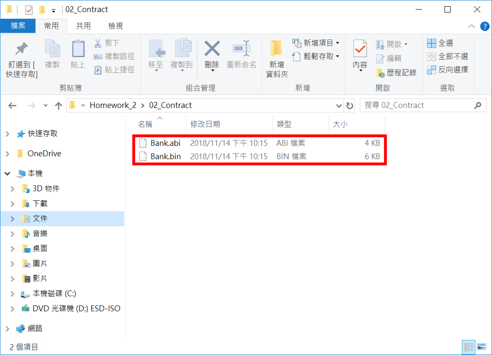
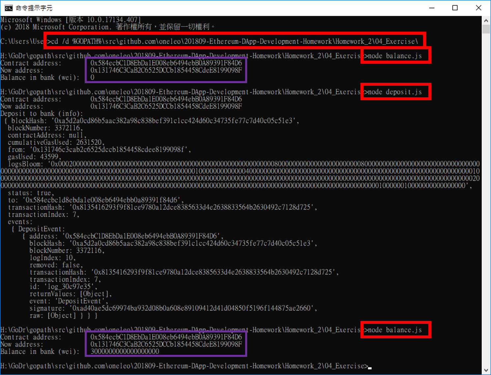
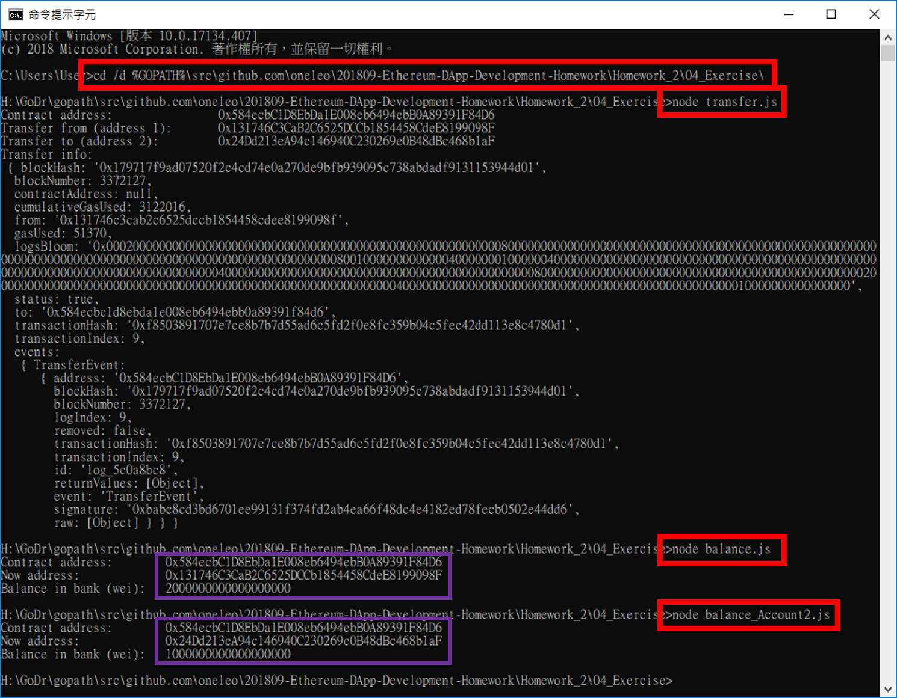
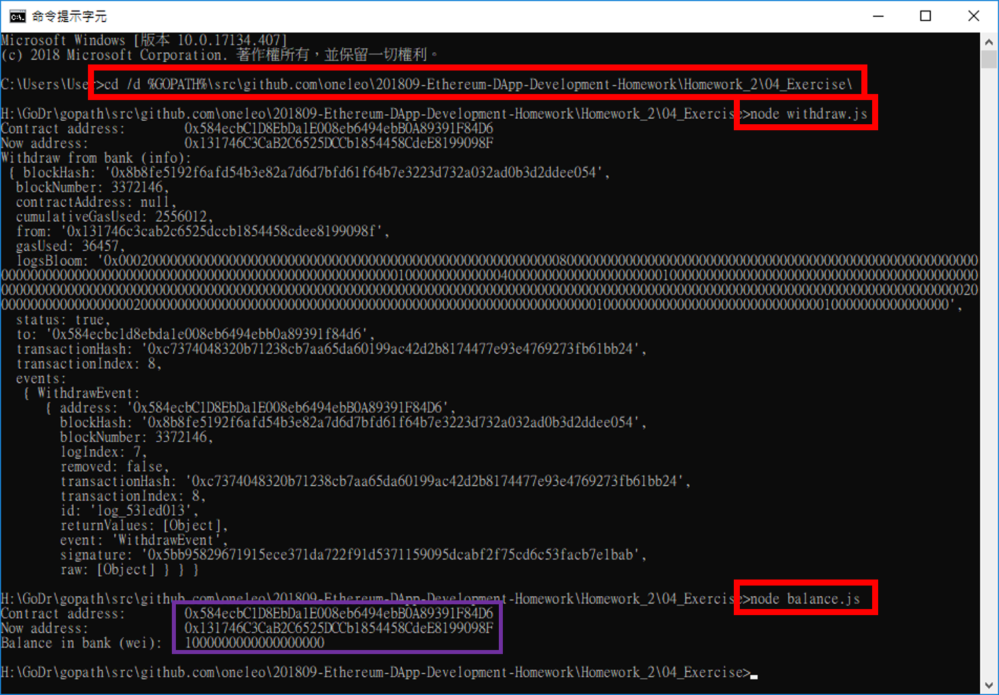
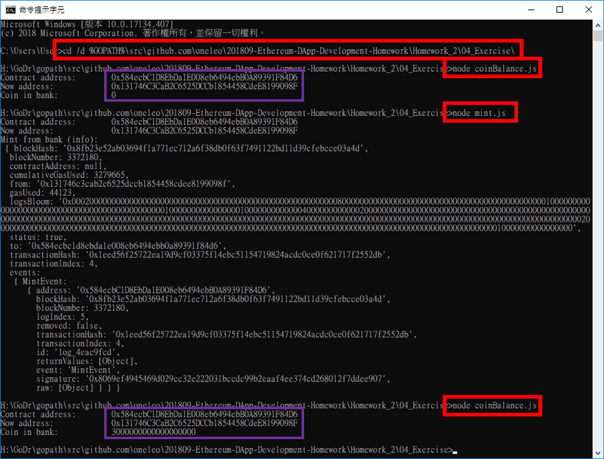
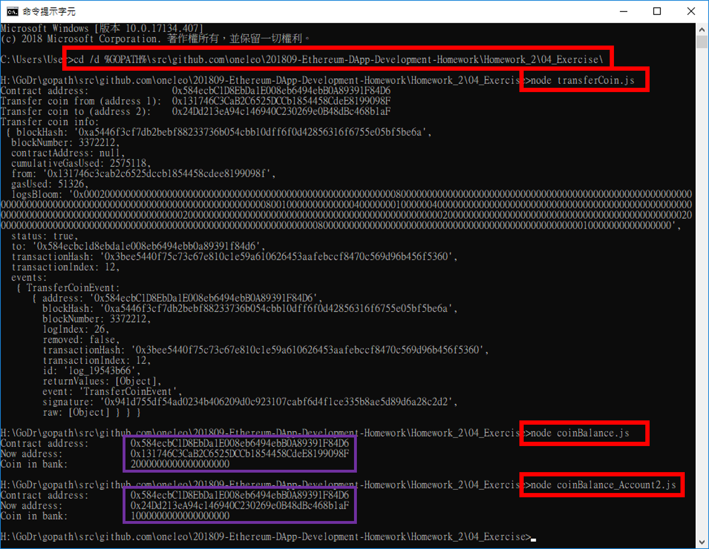
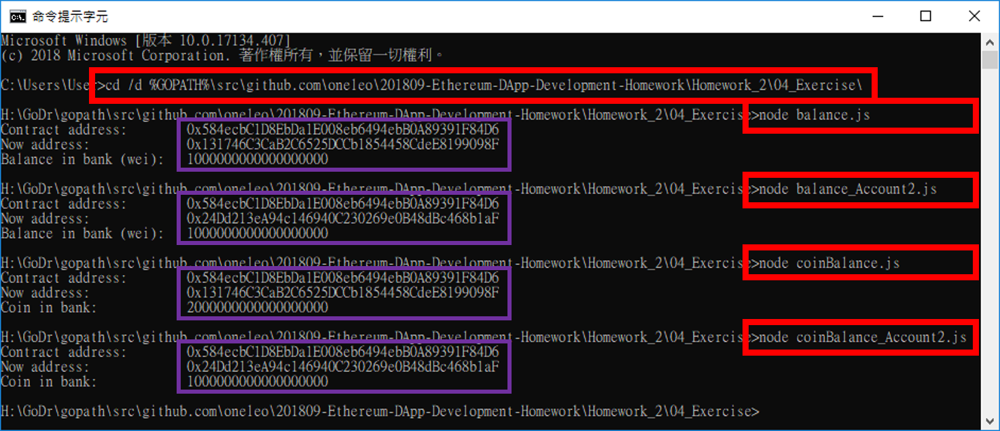
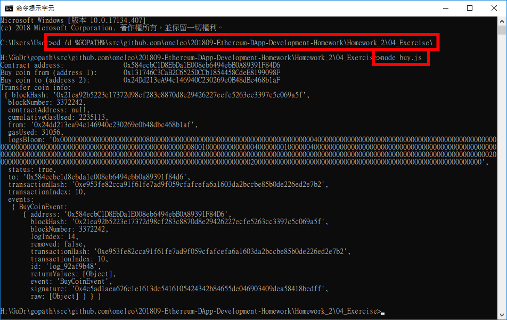
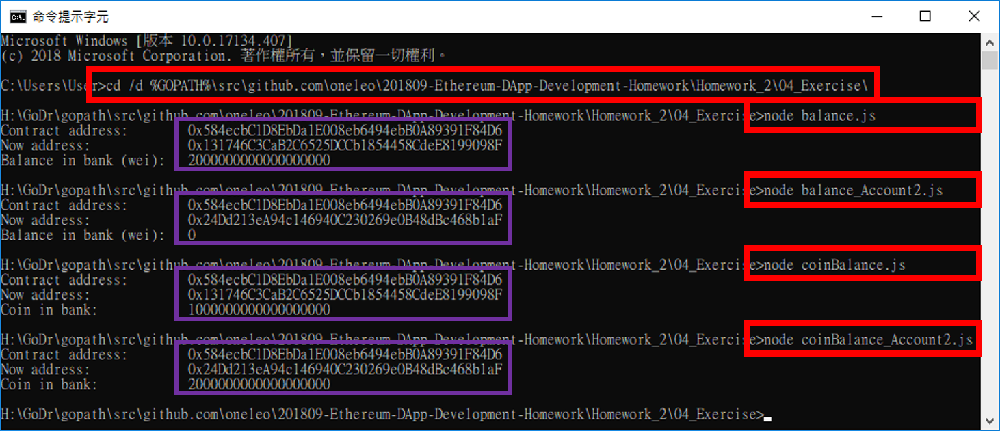
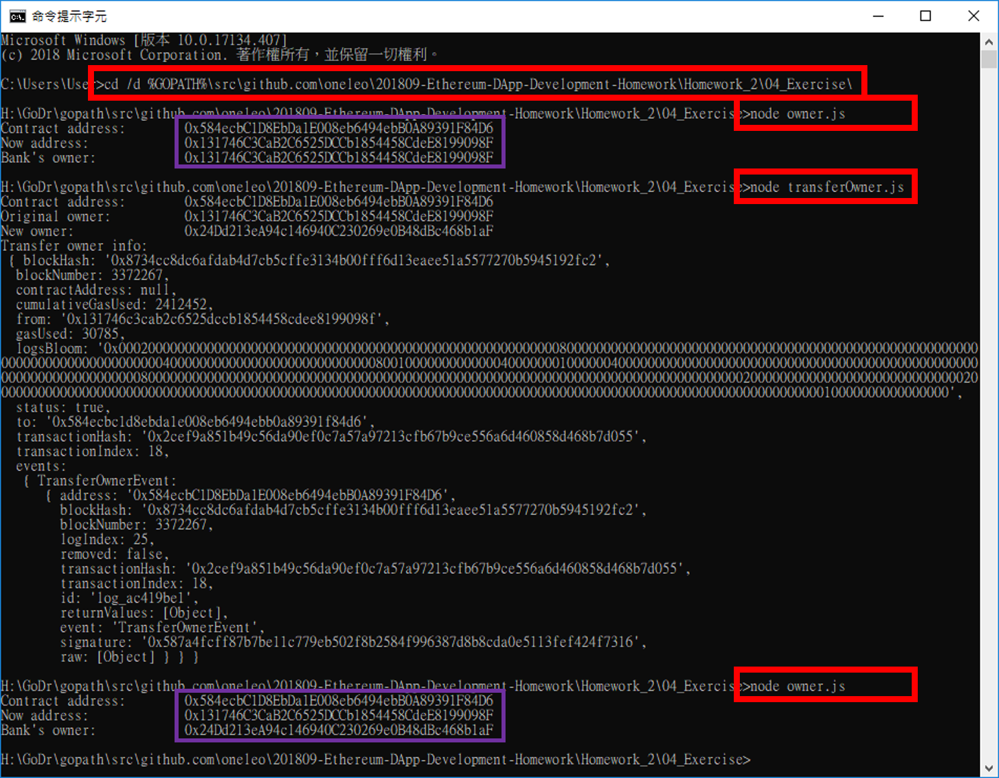

# Homework 2
> 作業位址：[Homework 2](https://drive.google.com/file/d/10WIulrT4K7r2vTAbslPbEOxt8faEZPyQ/view)
> 程式範例：[Sample Code](https://drive.google.com/drive/folders/1QvZBZXy6lcJgGmB4TSwYLp31Xmbas37R)

## 0、環境建置

- 【安裝筆記】在 Windows 10 作業系統內建置 Node.js 開發環境請參考[本篇文章](../Homework_1/SetupNodeEnvironment)。
- 【安裝筆記】在 Windows 10 作業系統內建置單機版 Ethereum 節點 Ganache 請參考[本篇文章](./SetupGanacheEnvironment)。
- 【安裝筆記】在 Windows 10 作業系統內建置 go-ethereum 開發環境請參考[本篇文章](./SetupGoEthereumEnvironment)。
- 【安裝筆記】在 Windows 10 作業系統內建置 solidity 編譯環境請參考[本篇文章](./SetupGoEthereumEnvironment)。

## 0、作業說明

- 本作業以部署在 Rinkeby testnet 為主。
- 為盡量符合真實情況，作業內容會先將 private key 加密儲存成 keystore（可參考此檔：[PrvKeyToKeystore.js](./PrvKeyToKeystore.js)），而在正式對 Rinkeby testnet 存取智能合約前，會先將 keystore 解密回 private key，再進行操作。

## 1、第 01 題：完成 Bank.sol 智能合約

- 這裡將完成的【[01_Bank.sol](./01_Bank.sol)】檔放置於【%GOPATH%/src/github.com/oneleo/201809-Ethereum-DApp-Development-Homework/Homework_2】內。

```solidity=1
//pragma solidity ^0.4.25;
pragma solidity ^0.5.0;

contract Bank {
	// 此合約的擁有者。
    address private _owner;

	// 儲存所有會員的 ether 餘額。
    mapping (address => uint256) private _balance;

	// 儲存所有會員的 bank coin 餘額。
    mapping (address => uint256) private _coinBalance;

	// 事件們，用於通知前端 web3.js。
    event DepositEvent(address indexed from, uint256 value, uint256 timestamp);
    event WithdrawEvent(address indexed from, uint256 value, uint256 timestamp);
    event TransferEvent(address indexed from, address indexed to, uint256 value, uint256 timestamp);

    event MintEvent(address indexed from, uint256 value, uint256 timestamp);
    event BuyCoinEvent(address indexed from, uint256 value, uint256 timestamp);
    event TransferCoinEvent(address indexed from, address indexed to, uint256 value, uint256 timestamp);
    event TransferOwnerEvent(address indexed oldOwner, address indexed newOwner, uint256 timestamp);

    // 修飾符。
    modifier isOwner() {
        // 要求只能是部署此合約的地址才能執行此函數。
        require(_owner == msg.sender, "You are not owner.");
        
        // 修飾符結束符號。
        _;
    }

	// 建構子，一部署就將部署此合約的地址儲存在 owner 內。
    constructor() public payable {
        _owner = msg.sender;
    }

	// 存款。
    function deposit() public payable {
        // 將呼叫此函數時，附帶的 ether 量累加進對映的地址。
        _balance[msg.sender] += msg.value;

        // emit DepositEvent：完成存款，發出事件。
        emit DepositEvent(msg.sender, msg.value, block.timestamp);
    }

	// 提款。
    function withdraw(uint256 etherValue) public {
        // 1 ether = 1,000,000,000,000,000,000 wei。
        uint256 weiValue = etherValue * 1 ether;

        // 要提款，必須要確認存在對映 msg.sender 的 ether 量大於想要提出的金額。
        require(_balance[msg.sender] >= weiValue, "Your ether balances are not enough.");

        // 將合約內指定的 ether 量轉移至 msg.sender。
        msg.sender.transfer(weiValue);

        // 將對映的 msg.sender 的 ether 量扣除。
        _balance[msg.sender] -= weiValue;

        // emit WithdrawEvent：完成提款，發出事件。
        emit WithdrawEvent(msg.sender, etherValue, block.timestamp);
    }

	// 轉帳。
    function transfer(address to, uint256 etherValue) public {
        // 1 ether = 1,000,000,000,000,000,000 wei。
        uint256 weiValue = etherValue * 1 ether;

        // 要轉帳，必須要確認存在此合約內對映地址的 ether 大於想要轉出的金額。
        require(_balance[msg.sender] >= weiValue, "Your ether balances are not enough.");

        // 將對映的 msg.sender 的 ether 量扣除。
        _balance[msg.sender] -= weiValue;
        
        // 將指定的 ether 量累加進接收的對映地址。
        _balance[to] += weiValue;

        // emit TransferEvent：完成轉帳，發出事件。
        emit TransferEvent(msg.sender, to, etherValue, block.timestamp);
    }

	// mint bank coin。
    function mint(uint256 coinValue) public isOwner {
        // 1 ether = 1,000,000,000,000,000,000 wei。
        uint256 value = coinValue * 1 ether;

        // 增加 msg.sender（= owner）的 bank coin balance。
        // your code。
        _coinBalance[msg.sender] += value;

        // emit MintEvent：完成鑄金，將鑄到的 bank coin 給 msg.sender（= owner），並發出事件。
        // your code。
        emit MintEvent(msg.sender, coinValue, block.timestamp);
    }

	// 使用 msg.sender 在 bank 中的 ether，向 owner 購買 bank coin。
    function buy(uint256 coinValue) public {
        // 1 ether = 1,000,000,000,000,000,000 wei。
        uint256 value = coinValue * 1 ether;

        // require owner 的 bank coin balance 不小於 value。
        // your code。
        require(_coinBalance[_owner] >= value, "Owner's bank coin balances are not enough.");

        // require msg.sender 的 etherBalance 不小於 value。
        // your code。
        require(_balance[msg.sender] >= value, "Your ether balances are not enough.");

        // msg.sender 的 etherBalance 減少 value。
        // your code。
        _balance[msg.sender] -= value;
        
        // owner 的 etherBalance 增加 value。
        // your code。
        _balance[_owner] += value;

        // msg.sender 的 bank coin balance 增加 value。
        // your code。
        _coinBalance[msg.sender] += value;
        
        // owner 的 bank coin balance 減少 value。
        // your code。
        _coinBalance[_owner] -= value;

        // emit BuyCoinEvent：msg.sender 完成 bank coin 購買，發出事件。
        // your code。
        emit BuyCoinEvent(msg.sender, coinValue, block.timestamp);
    }

	// 轉移 coin。
    function transferCoin(address to, uint256 coinValue) public {
        // 1 ether = 1,000,000,000,000,000,000 wei。
        uint256 value = coinValue * 1 ether;

        // require msg.sender 的 bank coin balance 不小於 value。
        // your code。
        require(_coinBalance[msg.sender] >= value, "Your bank coin balances are not enough.");

        // msg.sender 的 bank coin balance 減少 value 量。
        // your code。
        _coinBalance[msg.sender] -= value;
        
        // to 的 bank coin balance 增加 value 量。
        // your code。
        _coinBalance[to] += value;

        // emit TransferCoinEvent：完成 coin 轉移，發出事件。
        // your code。
        emit TransferCoinEvent(msg.sender, to, coinValue, block.timestamp);
    }

	// 檢查銀行帳戶 ether 餘額。
    function getBankBalance() public view returns (uint256) {
        return _balance[msg.sender];
    }

    // 檢查 bank coin 餘額。
    function getCoinBalance() public view returns (uint256) {
        return _coinBalance[msg.sender];
    }

    // get owner：取得目前此合約的 owner 地址。
    function getOwner() public view returns (address)  {
        return _owner;
    }

    // 轉移 owner。
    function transferOwner(address newOwner) public isOwner {
        // 檢查 newOwner 不是空地址，以避免此合約失去擁有者。
        require(newOwner != address(0));
        
        // emit TransferOwnerEvent：完成擁有者轉移，發出事件。
        // your code。
        emit TransferOwnerEvent(_owner, newOwner, block.timestamp);
        
        // transfer ownership：轉移擁有者。
        // your code。
        _owner = newOwner;
    }

    // 將此合約從 Blockchain 中銷毀，並把合約內所有 ether 發送到指定地址。
    function kill() public isOwner {
        selfdestruct(msg.sender);
    }
}
```

## 2、第 02 題：使用 solc 編譯智能合約

- 使用命令提示字元（%WINDIR%\system32\cmd.exe）程式執行下面指令：

```
> cd %GOPATH%\src\github.com\oneleo\201809-Ethereum-DApp-Development-Homework\Homework_2
> solc ./01_Bank.sol --bin --abi --optimize --overwrite -o ./02_Contract
```


- 編譯完成後，ABI 及 BIN 檔會被存放在【%GOPATH%\src\github.com\oneleo\201809-Ethereum-DApp-Development-Homework\Homework_2\[02_Contract](./02_Contract)】資料夾內。



## 3、第 03 題：使用 Web3 部署智能合約

- 這裡將完成的【[03_deploy.js](./03_deploy.js)】檔放置於【%GOPATH%/src/github.com/oneleo/201809-Ethereum-DApp-Development-Homework/Homework_2】內。

```javascript=1
// 使用 JavaScript 的嚴格模式。
'use strict';

// 定義 Byte 轉 Hex String 函數。
function toHexString(byteArray) {
    return Array.prototype.map.call(byteArray, function (byte) {
        return ('0' + (byte & 0xFF).toString(16)).slice(-2);
    }).join('');
}

// 定義 Hex String 轉 Byte 函數。
function toByteArray(hexString) {
    var result = [];
    while (hexString.length >= 2) {
        result.push(parseInt(hexString.substring(0, 2), 16));
        hexString = hexString.substring(2, hexString.length);
    }
    return result;
}

// 定義要連線的以太坊網路。
//const url = 'http://localhost:8545';
const url = 'https://rinkeby.infura.io';
//const url = 'wss://rinkeby.infura.io/ws';

// 定義 keystore 存放位置及解開密碼。
const keystoreFile = './keystore1';
const keystorePasswd = 'nccu';
// 設置智能合約 ABI 及 BIN 的放置地址。
const cntrtAbiFile = './02_Contract/Bank.abi';
const cntrtBinFile = './02_Contract/Bank.bin';
// 存放部署後的智能合約地址。
const cntrtAdrFile = './address.txt';
// 設置 gas limit 及 gas price。
const gasLmt = 3400000;
const gasPrc = 2000000000;

// 定義所需的套件。
const wallet = require('ethereumjs-wallet');
const fs = require('fs');
const web3 = require('web3');
// Reference:
// https://github.com/trufflesuite/truffle-hdwallet-provider
// https://github.com/nosuchip/truffle-privatekey-provider
// https://ethereum.stackexchange.com/questions/46203/deploy-contract-on-live-testnet-using-private-key-truffle
// https://github.com/lendingblock/loan-contracts#using-private-key
const prvKeyProvider = require("truffle-privatekey-provider");

// 定義 Bank.sol 的 abi。
const abi = JSON.parse(fs.readFileSync(cntrtAbiFile).toString());
// 定義 Bank.sol 的 byte code。
const bytecode = '0x' + fs.readFileSync(cntrtBinFile).toString();

// 將 keystore Json 讀出後，再使用 nccu 作為密碼將 Private 解密。
let keyStoreAccount = wallet.fromV3(fs.readFileSync(keystoreFile).toString(), keystorePasswd, true);
// 取得 keystore 的 private key byte 型式。
let prvKey = keyStoreAccount.getPrivateKey();
// 取得 keystore 的 private key hex string 型式。
let prvKeyHex = toHexString(prvKey);
// 印出從 keystore 取得的 private key hex string 型式。
//console.log("Recovered private key:\t", prvKeyHex);

// 根據輸入的 private key hex string 建立一個 accounts provider 提供者。
let provider = new prvKeyProvider(prvKeyHex, url);
// 根據 provider 建立一 web3 連線實體。
let client = new web3(provider);

// 取得 client 內的所有帳號。
client.eth.getAccounts().then(async function (accounts) {
    // deploy contract
    // your code
    console.log("Deploy from account:\t", accounts[0]);
    // 透過 abi 建立一個即將部署在 client 上的 smart contract 實體 bank。
    let bank = await new client.eth.Contract(abi);

    // 給定 bytecode 合約原始碼、arguments 初始值、from 部署者、gas limit、以太幣 value 後，將 smart contrace 部署至以太坊網路。
    let result = await bank
        .deploy({ data: bytecode, arguments: [] })
        .send({ from: accounts[0], gas: gasLmt, gasPrice: gasPrc, value: 0 })
        .catch(function (error) { console.log("Error occurred:\n", error); });

    //This will display the address to which your contract was deployed
    console.log("Contract deployed to:\t", result.options.address);
    // 部署成功後將合約 address 寫至 address.txt
    fs.writeFileSync(cntrtAdrFile, result.options.address);
});

// At termination, 'provider.engine.stop()' should be called to finish the process elegantly.
provider.engine.stop();

```

- 使用命令提示字元（%WINDIR%\system32\cmd.exe）程式執行下面指令：

```
> cd /d %GOPATH%\src\github.com\oneleo\201809-Ethereum-DApp-Development-Homework\Homework_2
> node .\03_deploy.js
```


## 4、第 04 題：透過 Web3 使用合約 function

- 相關的程式碼，請參考以下列表：
	- [balance.js](./04_Exercise/balance.js)
	- [balance_Account2.js](./04_Exercise/balance_Account2.js)
	- [buy.js](./04_Exercise/buy.js)
	- [coinBalance.js](./04_Exercise/coinBalance.js)
	- [coinBalance_Account2.js](./04_Exercise/coinBalance_Account2.js)
	- [deposit.js](./04_Exercise/deposit.js)
	- [mint.js](./04_Exercise/mint.js)
	- [owner.js](./04_Exercise/owner.js)
	- [transfer.js](./04_Exercise/transfer.js)
	- [transferCoin.js](./04_Exercise/transferCoin.js)
	- [transferOwner.js](./04_Exercise/transferOwner.js)
	- [transferOwner_Account2.js](./04_Exercise/transferOwner_Account2.js)
	- [withdraw.js](./04_Exercise/withdraw.js)
	- [withdraw_Account2.js](./04_Exercise/withdraw_Account2.js)

- Account 1 存入 3 顆以太幣至 Bank 帳戶，以及查看在 Bank 內的以太幣數量：

```
> cd /d %GOPATH%\src\github.com\oneleo\201809-Ethereum-DApp-Development-Homework\Homework_2\04_Exercise 
> node .\balance.js
> node .\deposit.js
> node .\balance.js
```



- Account 1 將 Bank 帳戶內的 1 顆以太幣轉至 Account 2 的 Bank 帳戶：

```
> node .\transfer.js
> node .\balance.js
> node .\balance_Account2.js
```



- Account 1 將 Bank 帳戶內的 1 顆以太幣領出：

```
> node .\withdraw.js
> node .\balance.js
```



- Account 1 鑄出 3 顆 Bank_Coin 幣至 Bank 帳戶：

```
> node .\coinBalance.js
> node .\mint.js
> node .\coinBalance.js
```



- Account 1 空投 1 顆 Bank_Coin 幣至 Account 2 的 Bank 帳戶內：

```
> node .\transferCoin.js
> node .\coinBalance.js
> node .\coinBalance_Account2.js
```



- Account 2 覺得 Bank_Coin 幣會大漲，所以用 Bank 帳戶裡的 1 顆以太幣，向 Account 2 購買 1 顆 Bank_Coin 幣，並存至 Bank 帳戶內：

```
> node .\balance.js
> node .\balance_Account2.js
> node .\coinBalance.js
> node .\coinBalance_Account2.js

> node buy.js

> node .\balance.js
> node .\balance_Account2.js
> node .\coinBalance.js
> node .\coinBalance_Account2.js
```







- Account 1 覺得 Bank 沒有價值，於是將 Bank 的擁有權給充滿信仰的 Account2：

```
> node .\owner.js
> node .\transferOwner.js
> node .\owner.js
```

